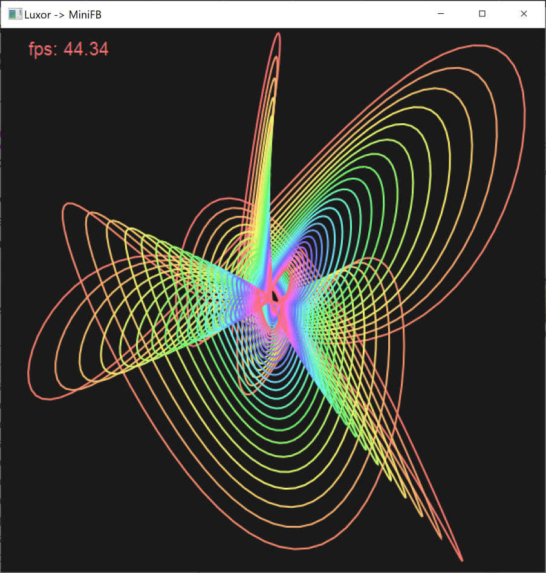

This code shows how visualisations created with [Luxor.jl](https://github.com/JuliaGraphics/Luxor.jl) can be
rendered easily with MiniFB.

Add the Luxor, Colors and MiniFB packages to your environment before running this code.

```julia
using Luxor, MiniFB, Colors
```

[Guilloché](https://en.wikipedia.org/wiki/Guilloch%C3%A9) is a decorative technique in which a very precise, intricate and repetitive pattern is mechanically
engraved into an underlying material via engine turning. The following struct contains the metadata used to render the pattern.

```julia
mutable struct Guilloche
    f1::Float64
    f2::Float64
    f3::Float64
    f4::Float64
```

damping factors: increase to make the energy losses faster

```julia
    xd1::Float64
    xd2::Float64
    yd1::Float64
    yd2::Float64
```

phase factors

```julia
    xp1::Float64
    xp2::Float64
    yp3::Float64
    yp4::Float64
end
```

A function that draws a single frame of the Guilloché, using Luxor.jl functions

```julia
function drawguilloche(g::Guilloche, radius=20;
        npoints=100, limit=1000, stepby=0.025, colorfunction=(t) -> setopacity(1.0))
    function nextposition(t)
        x = exp(-g.xd1 * t) * (radius * sin((g.f1 * t) + g.xp1)) + exp(-g.xd2 * t) * (radius * sin((g.f2 * t) + g.xp2))
        y = exp(-g.yd1 * t) * (radius * cos((g.f3 * t) + g.yp3)) + exp(-g.yd2 * t) * (radius * cos((g.f4 * t) + g.yp4))
        return (x, y)
    end
    counter = 0
    move(nextposition(0)...)
    for t in 0:stepby:npoints
        colorfunction(t)
        line(nextposition(t)...)
        counter += 1
        if counter > limit
            counter = 0
            strokepath()
            colorfunction(t)
            move(nextposition(t)...)
        end
    end
    strokepath()
end
```

The main method sets up the Guilloche struct, opens the window for display, and animates the frames using a while loop.

```julia
function main()
    WIDTH  = 600
    HEIGHT = 600
    window = mfb_open_ex("Luxor -> MiniFB", WIDTH, HEIGHT, MiniFB.WF_RESIZABLE)
    y = 0.1
    g2 = Guilloche(2, 1.5, 3, 1,
        0.0005, 0.0005, 0.0005, 0.0005,
        .1, .1, .1, .1)
    t1 = time_ns()
    while true
```

The Luxor `@imagematrix` macro creates a 2D matrix of Color objects in ARGB32 format, which is exactly what MiniFB requires

```julia
        buffer = @imagematrix begin
                    background("grey10")
                    fontsize(20)
                    sethue("orange")
                    g2.xd1 = y/70
                    g2.xd2 = y/80
                    g2.yd1 = y/90
                    g2.yd2 = y/100
                    g2.xp1 = 8y
                    g2.xp2 = 4y
                    g2.yp3 = 1y
                    g2.yp4 = 3y
                    drawguilloche(g2, 150,
                        npoints=300,
                        stepby=0.05,
                        limit=10,
                        colorfunction = (t) -> sethue(HSL(rescale(t, 0, 300, 0, 359), 0.9, 0.7)))
                    t2 = time_ns()
                    text(string("fps: ", round(1E9/(t2-t1), digits=2)),
                        boxtopleft(BoundingBox() * 0.9))
                end 600 600
        y = y + 0.001
        (y > 1) && (y = 0.1)
```

The image matrix created by Luxor is, in standard Julia convention, column first. The buffer
expected by MiniFB is row first. The call to `permutedims` makes that change.

```julia
        state = mfb_update(window, permutedims(buffer, (2, 1)))
        t1 = t2
```

Exit when the user closes the window.

```julia
        if state != MiniFB.STATE_OK
            break
        end
    end
    mfb_close(window)
end
```

Call the main function. This produces really attractive animations -- I highly reccomend you run this yourself!
The static image below shows you one frame, but does not do justice to the whole animation.

```julia
main()
```



_Thanks to [`@Cormullion`](https://github.com/cormullion) for this example_

