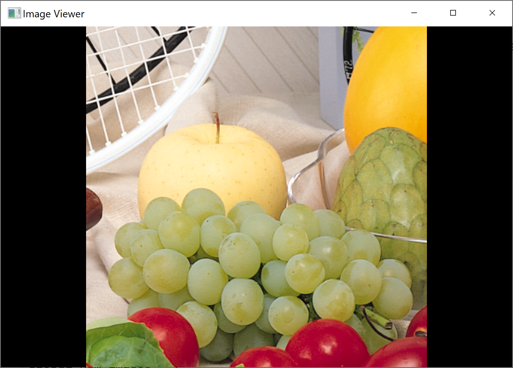

### Image viewer using MiniFB
This example displays the PNG files in a directory, rotating through the available images on each mouse click.

This code needs Images.jl and ImageTransformations.jl. Add those packages to your environment before proceeding

```julia
using Images
using ImageTransformations
using MiniFB
```

Set the size of the window

```julia
global const WIDTH = 600
global const HEIGHT = 400
```

Global state

```julia
global ni = 1
global num_images = 1
```

A function that will be called when a mouse button is clicked. It simply rotates the current image by storing a global integer.

```julia
function onclick(window, button, mod, isPressed)::Cvoid
    global ni, num_images
    if Bool(isPressed)
        if ni < num_images
            ni = ni+1
        else
            ni = 1
        end
    end
    return nothing
end
```

Populate a MiniFB buffer from the image data.
First, resize the image to the window dimensions. Calculate it's position so that it is centered in the window.
Finally, inside the loop, convert each pixel to the 32 bit MiniFB buffer format.

```julia
function populate_buffer!(buffer, img)
    global WIDTH, HEIGHT
    buffer[:] = zeros(UInt32, HEIGHT*WIDTH)
    h, w = size(img)
    ratio = min(1, HEIGHT/h, WIDTH/w)
    nimg = imresize(img, ratio=ratio)
    nh, nw = size(nimg)
    oh = (HEIGHT-nh) ÷ 2
    ow = (WIDTH-nw) ÷ 2
    for i in 1:nh
        for j in 1:nw
            buffer[(oh+i-1)*WIDTH + ow+j] = mfb_rgb(nimg[i,j])
        end
    end
end
```

This is the main function. It takes a directory, calls `loadfiles` to get the image data.
Creates the windows, and sets up the callback. Then, inside the `while` loop, renders the buffer into the window.
The `mfb_update` not only renders the buffer, but also flushes the input event queue.
The buffer is changed only when the state changes. The `mfb_wait_sync` method enforces the required frame rate.

```julia
function imageview(dir::String=".")
    global ni, num_images
    images = loadfiles(dir)
    num_images = length(images)
    buffer = zeros(UInt32, HEIGHT*WIDTH)
    mfb_set_target_fps(10)
    window = mfb_open_ex("Image Viewer", WIDTH, HEIGHT, MiniFB.WF_RESIZABLE);
    mfb_set_mouse_button_callback(window, onclick);
    old_ni=0
    while mfb_wait_sync(window)
        if ni != old_ni
            populate_buffer!(buffer, images[ni])
            old_ni = ni
        end
        state = mfb_update(window, buffer);
        if state != MiniFB.STATE_OK
            break;
        end
    end
    mfb_close(window)
end
```

Load the files from disk. Select all png files, and then use ImageIO to load them into memory.

```julia
function loadfiles(dir::String=".")
    files = readdir(dir)
    filter!(x->occursin(r"\.png"i, x), files)
    [load(joinpath(dir,x)) for x in files]
end
```

Finally, call the main method to display the application

```julia
imageview(joinpath(dirname(pathof(MiniFB)),"..", "example"))
```


