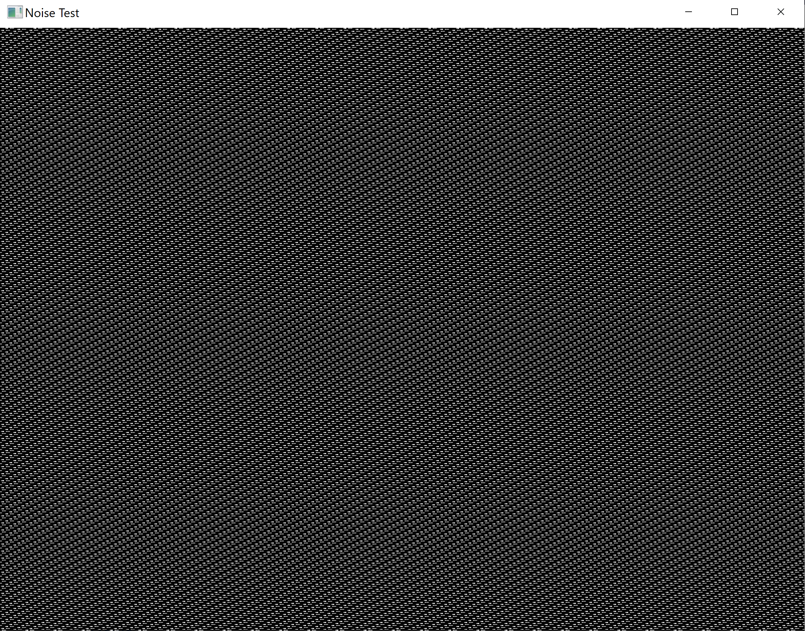

```julia
using MiniFB
```

A simple function that renders some noise to a window. Demonstrates how to create a window and render a buffer into it using MiniFB

```julia
function noise()
    WIDTH = 800
    HEIGHT = 600
    g_buffer = zeros(UInt32, WIDTH * HEIGHT)
    noise = carry = seed = 0xbeef
    window = mfb_open_ex("Noise Test", WIDTH, HEIGHT, MiniFB.WF_RESIZABLE);
    while mfb_wait_sync(window)
        for i in 1:WIDTH * HEIGHT
            noise = seed;
            noise = noise >> 3;
            noise = noise ^ seed;
            carry = noise & 1;
            noise = noise >> 1;
            seed = seed >> 1;
            seed = seed | (carry << 30);
            noise = noise & 0xFF;
            g_buffer[i] = mfb_rgb(noise, noise, noise);
        end
        state = mfb_update(window, g_buffer);
        if state != MiniFB.STATE_OK
            break;
        end
    end
    mfb_close(window)
end
```

Call the function

```julia
noise()
```



